<div align="center">

# Freyr's Eye 🌱

### Know exactly what your plants need — without guessing.

**An AIoT plant monitoring system: a soil-planted sensor + mobile app + AI advisor that identifies any plant from a photo and tells you when to water, in plain language.**

[](https://hacknarok.pl/)
[]()
[]()

</div>

---

> 🏆 **2nd place — Hacknarök X (April 19, 2026)**
> Built in 24 hours at the 10th anniversary edition of EESTEC AGH Kraków's Nordic-themed hackathon. The event ran under a *Smart Viking City* theme, which is why you'll find the occasional saga reference in our copy and a digital "skald" persona inside the chat — but the product itself is a fully functional plant care system that works for any indoor garden, community plot, or greenhouse.

---

## 🎬 Demo

<p align="center">
  <a href="https://www.youtube.com/watch?v=k3n2ZhQ2eA8">
    
  </a>
  <br/>
  <em>▶️ Click to watch the 22-second demo</em>
</p>

<p align="center">
  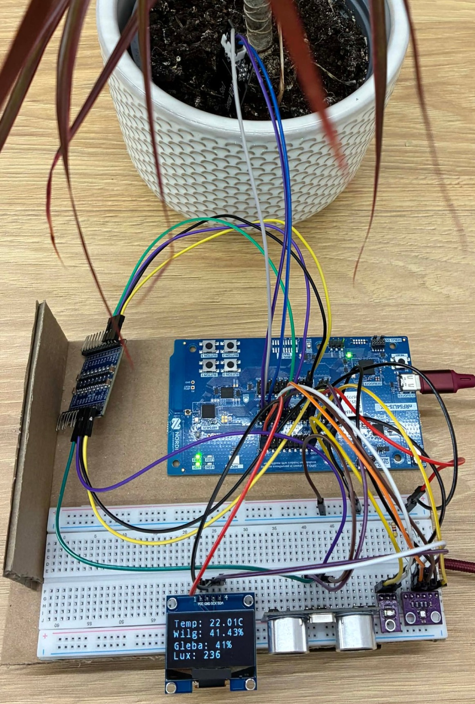
  &nbsp;&nbsp;&nbsp;
  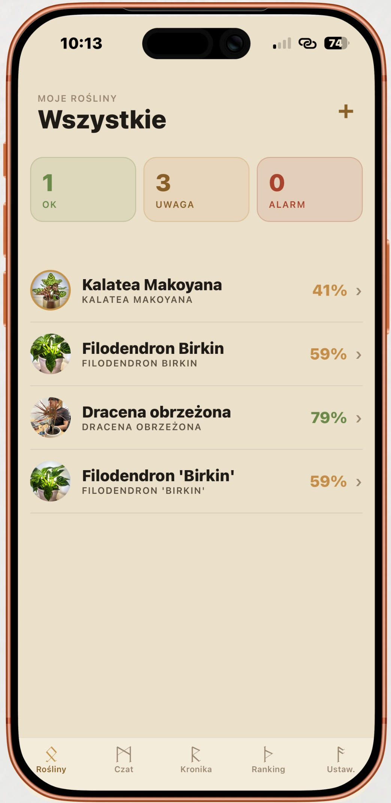
</p>

---

## 📌 What it does

Plants die because their owners don't know what they actually need. Generic care guides don't help when you have a specific plant in a specific spot with specific light and humidity.

**Freyr's Eye** closes that loop end-to-end:

1. **Plant the sensor** in the soil — it measures soil moisture, air temperature, humidity, and light intensity.
2. **Snap a photo** in the mobile app — Gemini Vision identifies the species and pulls the optimal growth ranges.
3. **Get specific, actionable advice** — the app compares live readings to the ideal range and tells you exactly what to do, when. No charts to interpret, no Googling.

A full-stack project — **firmware (Zephyr RTOS) + mobile (React Native) + backend (Cloudflare Workers) + AI (Gemini Vision)** — built in 24 hours.

**Why this is different from yet-another-plant-app:**
- 🔌 Real hardware, not just a dashboard — custom BLE sensor running on nRF54L15
- 🧠 LLM as a UX layer, not a data pipe — translates raw sensor data into concrete actions
- 📡 Works offline at the edge — OLED display shows readings without a phone
- 🔋 Years on a single battery thanks to BLE LE
- 🏘️ Scales from one pot to a whole community garden

---

## ✨ Features

### 🌿 AI species recognition
Snap a photo, and Gemini Vision identifies the species in a fraction of a second and pulls the ideal ranges — soil moisture, light, temperature, air humidity. No more guessing, no more plants that wilt after a week because their owner didn't know how to care for them.

<p align="center">
  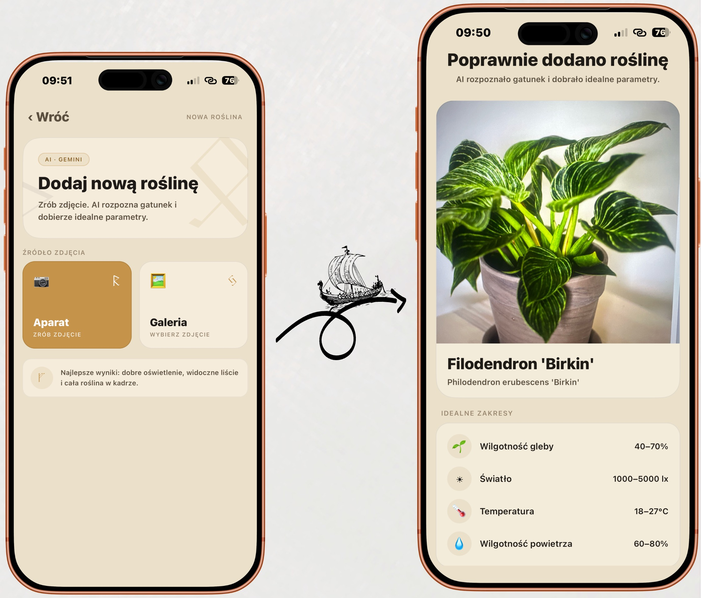
</p>

### 📡 Pair the Freyr Node over BLE
Pair the Freyr Node sensor over Bluetooth in seconds. Temperature, air humidity, soil moisture, and light intensity — all live, in one place. No cables, no setup wizard.

<p align="center">
  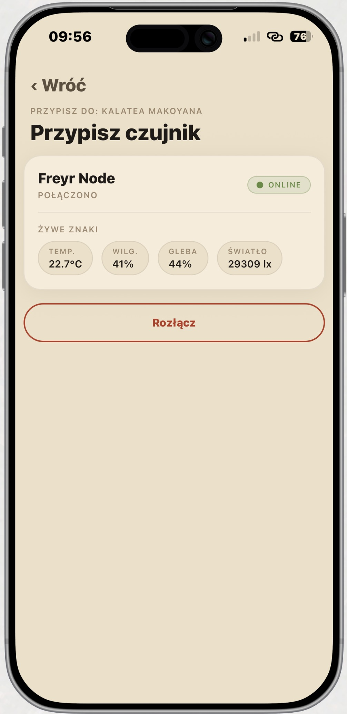
</p>

### 📊 Live monitoring — app + OLED
Every parameter is visible both in the mobile app and on the on-device OLED display, so you can check on your plant whether or not your phone is around. The system flags when it's time to water.

<p align="center">
  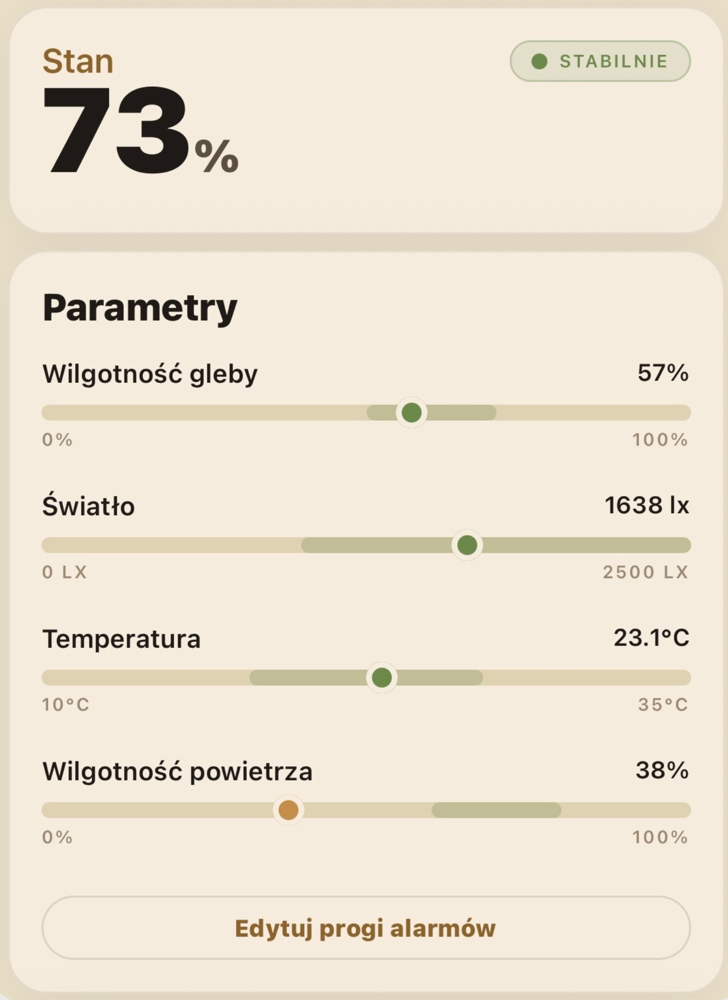
  &nbsp;&nbsp;&nbsp;
  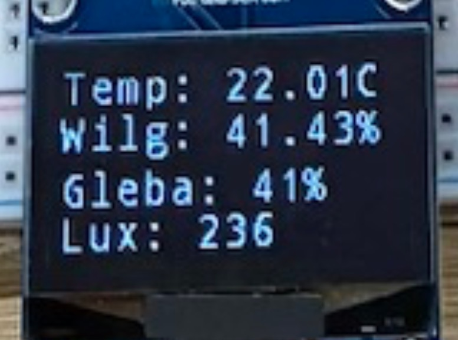
</p>

### 💬 Plant-aware chat assistant
A built-in chat answers questions in context. Responses are scoped to the specific plant the user is asking about — you won't get apple-tree advice when asking about a cactus. A personal plant advisor, available 24/7, tuned to your actual sensor data.

<p align="center">
  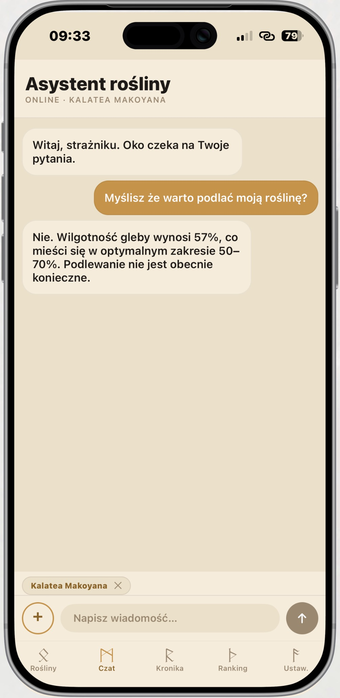
</p>

### 📜 Care journal
Log watering, pruning, fertilizing, and other care actions to avoid overwatering and to track plant status over time. (We call it the *Chronicle* — a small nod to the hackathon theme.)

<p align="center">
  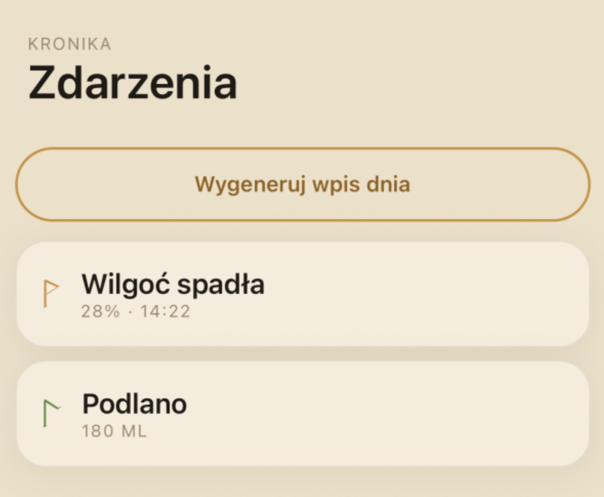
</p>

### 🏆 Community leaderboard
See how your plants are doing compared to other users. The ranking averages the condition of all plants in your collection and stacks it against the community — friendly competition that motivates better care and surfaces what works for others.

<p align="center">
  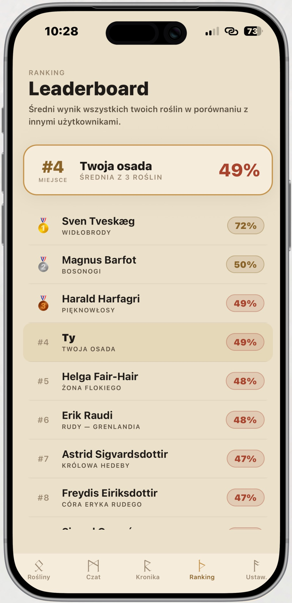
</p>

### 🔋 Years on a single battery
Built on the Nordic Semiconductor nRF54L15 with Bluetooth LE — the Freyr Node runs for years on a single battery, no wall power needed.

---

## 🛠 Tech stack

### Hardware
| Component | Role |
|---|---|
| **nRF54L15-DK** | MCU + BLE 5.4, main controller |
| **BME280** (I²C) | temperature, air humidity, pressure |
| **TEMT6000** (ADC) | light intensity |
| **HW-390** (ADC, capacitive) | soil moisture — capacitive, no corrosion |
| **VL53L1X ToF** (I²C) | proximity wake-up — hand approach wakes the display |
| **OLED 1.3" SH1106** (I²C, 128×64) | local readout without phone |
| **RGB LED** | status indicator (green / yellow / red) |

### Firmware
- **Zephyr RTOS** (nRF Connect SDK)
- **Nordic SoftDevice / BLE host stack**
- Custom GATT service with per-sensor characteristics + notify

### Mobile
- **React Native** + **Expo Dev Client** (native BLE requires a dev client, not Expo Go)
- **react-native-ble-plx** — BLE communication
- **Zustand** — state management
- **React Navigation**, **Victory Native** — charts
- **expo-image-picker** — plant photography

### Backend / AI
- **Google Gemini API** (`gemini-3-flash-preview`) — vision for species identification + contextual chat
- **Hono on Cloudflare Workers** — proxy, so the API key never lives in the app

**Why Gemini 3 Flash:** thinking model with configurable reasoning effort, multimodal input (image + text), 1M token context, automatic context caching (species + optimal ranges stay constant for the session).

---

## 📁 Repository structure

Monorepo:

```
freyrs-eye/
├── app/                    # React Native + Expo Dev Client
│   ├── src/
│   │   ├── ble/            # ble-plx wrapper, GATT codec
│   │   ├── screens/        # Dashboard, Onboarding, AIAdvisor, History
│   │   ├── components/     # SensorCard, StatusBadge, PlantAvatar
│   │   └── services/       # gemini client, persistence
├── backend/                # Hono on Cloudflare Workers (Gemini proxy)
├── firmware/               # Zephyr application for nRF54L15-DK
├── design_prototype/       # UI mockups
└── docs/                   # README screenshots, diagrams
```

---

## 🌍 Use cases — from one pot to a whole settlement

| Scale | Use case |
|---|---|
| **Single plant** | Home herb garden — sage, thyme, basil. Alert when too dry |
| **Vegetable garden** | Multiple Freyr Nodes in a BLE mesh, phone aggregates readings |
| **Greenhouse / nursery** | Monitor humidity to prevent mold on seedlings or stored harvest |
| **Community garden** | Shared monitoring across a plot, with the leaderboard adding social motivation |
| **Historical reconstructions** | Period-authentic crops at open-air museums under continuous care |
| **Apiary** *(stretch)* | Hive temperature as a proxy for colony health |

---

## 👥 Team — *Impreza Informatyków*

- **Paweł Bolek**
- **Konrad Drożdż**
- **Maciej Klepacki**
- **Paweł Małkowski**

---

## 🏆 Hackathon

**Hacknarök X** — April 18–19, 2026, Lubicz Park, Kraków. The 10th anniversary edition of the largest Nordic-themed programming marathon in Poland, organized by EESTEC AGH Kraków. 24 hours, specialist category, theme *Smart Viking City*.

**🥈 Result: 2nd place.**

---
## 📸 And some pics from event

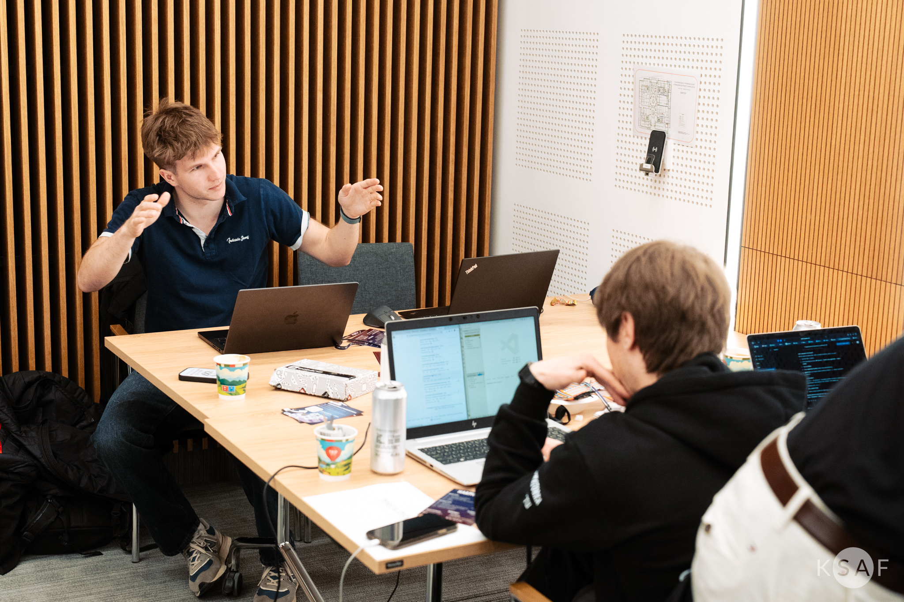
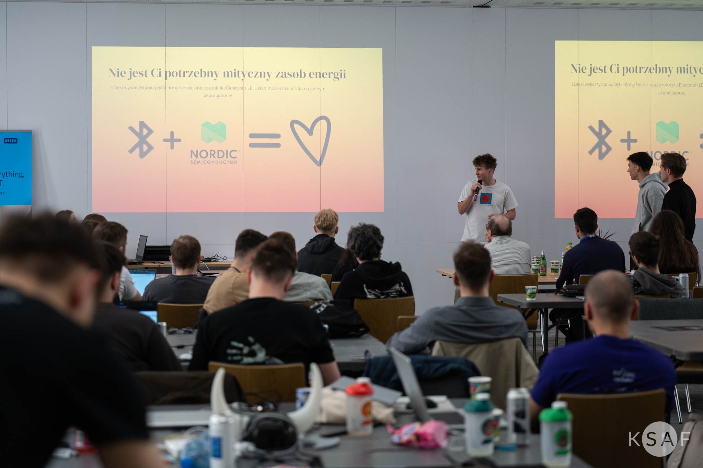
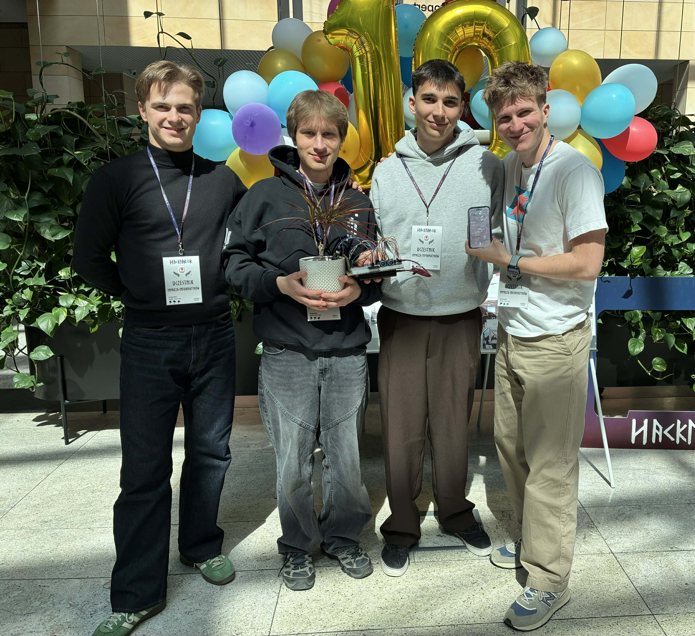
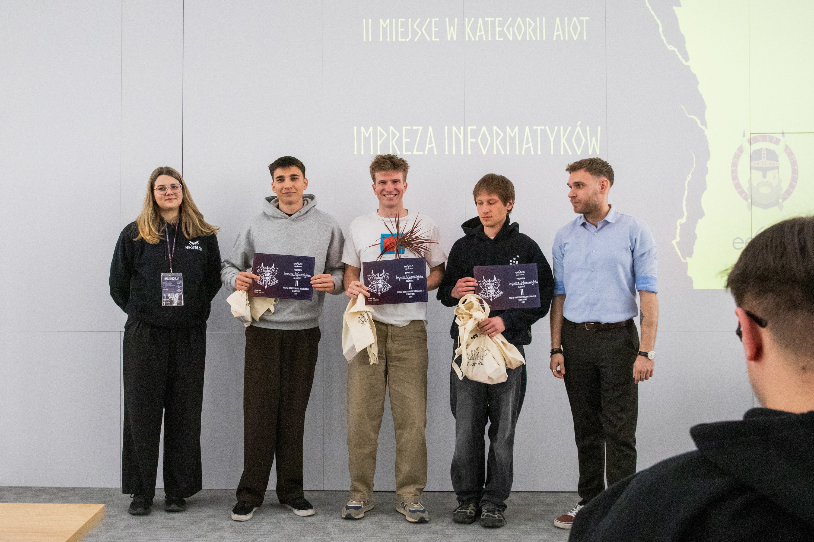

---
## 📜 License

MIT
